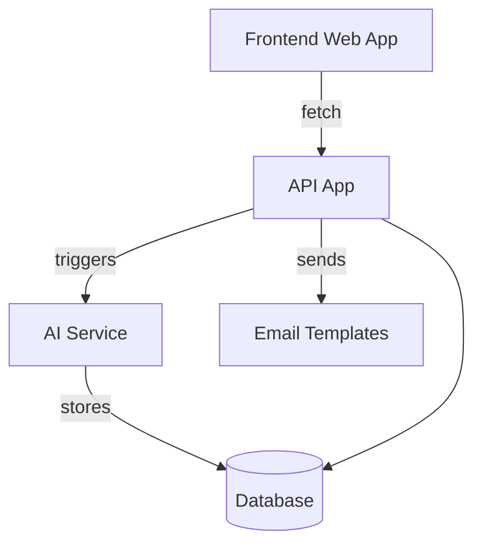

# Webs Architecture

Webs is organized as a turborepo with multiple applications and shared packages. The high-level flow is:

1. **app** – Next.js frontend where users input URLs and receive AI-powered summaries.
2. **api** – Next.js backend providing user, session and data APIs.
3. **ai** – Mastra-based service that processes URLs and prompts using LLMs.
4. **email** – React Email templates for notifications.

Shared packages provide utilities such as authentication, analytics, UI components and more.

The diagram above illustrates the interactions between applications. Mastra agents in the `ai` app communicate with external providers and the database. The `app` frontend orchestrates user requests and displays results.
