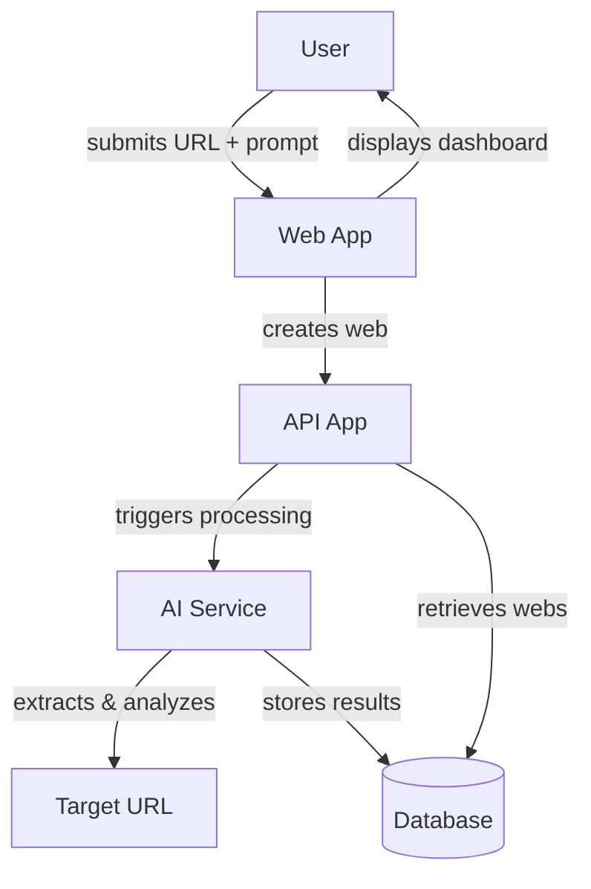

# Webs Architecture

Webs is an AI-native internet interface that processes URLs with optional prompts. It's organized as a turborepo with multiple applications and shared packages.

## Core Concept: Webs

Each "web" represents a URL that has been submitted for AI processing, optionally with additional instructions. Users can browse their collection of webs in a grid or list view, and click through to see detailed information about each processed URL.

## Application Structure

1. **app** – Next.js frontend providing the command interface for URL submission and web browsing dashboard
2. **api** – Next.js backend handling web creation, storage, and retrieval
3. **ai** – Mastra-based service that processes URLs and generates AI-enhanced summaries
4. **email** – React Email templates for notifications

## Data Flow

## Key Features

- **URL-First Interface**: Primary input is always a URL, with optional text instructions
- **Web Dashboard**: Browse processed URLs organized by domain in grid or list views  
- **AI Processing**: Each web is enhanced with AI-generated summaries and metadata
- **Real-time Updates**: Status tracking from PENDING → PROCESSING → COMPLETE

The architecture emphasizes simplicity and focuses on the core use case of intelligent URL processing and organization.
