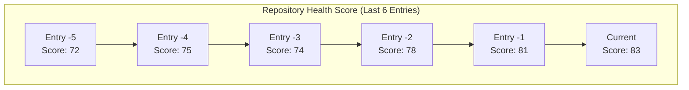
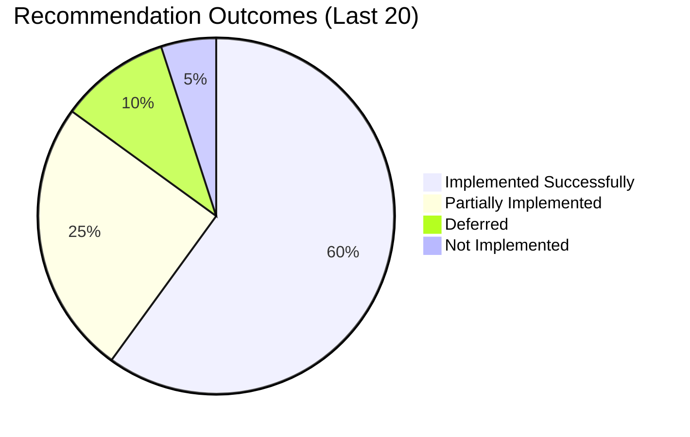
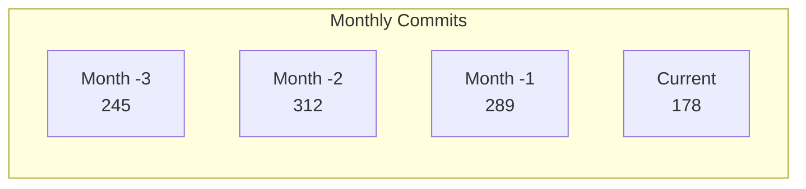
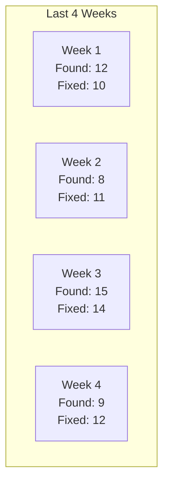

# Repository Metrics Dashboard

## Health Score Trend

## Key Metrics Over Time

| Metric | Entry -3 | Entry -2 | Entry -1 | Current | Trend |
|--------|----------|----------|----------|---------|-------|
| Architecture Score | 7.2 | 7.5 | 7.8 | 8.1 | ↑ |
| Integration Health | 68% | 72% | 75% | 78% | ↑ |
| Tech Debt Ratio | 18% | 16% | 14% | 12% | ↓ |
| Test Coverage | 72% | 74% | 76% | 78% | ↑ |
| Doc Coverage | 65% | 70% | 73% | 75% | ↑ |
| DX Score | 3.8/5 | 4.0/5 | 4.1/5 | 4.2/5 | ↑ |

## Recommendation Tracking

### Recommendation Success Rate

### Impact of Implemented Recommendations
| Recommendation | Implemented | Expected Impact | Actual Impact |
|----------------|-------------|-----------------|---------------|
| Doc expansion | 2025-05-25 | Better onboarding | TBD |
| Add integration tests | Pending | Higher reliability | - |

## Development Activity Metrics

### Contribution Patterns

### Component Activity Heat Map
| Component | Commits | PRs | Issues | Activity Level |
|-----------|---------|-----|--------|----------------|
| App 1 | 45 | 12 | 8 | 🔥 High |
| App 2 | 23 | 6 | 3 | 🟢 Normal |
| Package 1 | 67 | 15 | 12 | 🔥 High |
| Package 2 | 12 | 3 | 1 | 🟢 Normal |

## Quality Metrics

### Bug Discovery vs Resolution

### Code Quality Indicators
- **Cyclomatic Complexity**: Average 8 (Target: <10)
- **Duplication**: 2% (Target: <3%)
- **Code Smells**: 5 (Down from 7)

## Performance Metrics

### Build Performance
| Metric | 30 Days Ago | Current | Change | Target |
|--------|-------------|---------|--------|-------|
| Cold Build | 5m 23s | 4m 45s | -11.8% | 4m |
| Hot Reload | 1.2s | 0.9s | -25% | <1s |
| Test Suite | 3m 10s | 2m 50s | -10.5% | 2m 30s |

### Runtime Performance
- **Initial Load**: 1.2s (Target: 1s)
- **Memory Usage**: 120MB (Baseline: 150MB)
- **API Response**: p95 240ms

## Prediction & Trends

### Projected Improvements
Based on current velocity:
- **Tech Debt Zero**: ~6 months
- **Full Test Coverage**: ~12 weeks
- **Architecture Score 9+**: ~4 months

### Risk Indicators
- 🔴 **Integration gaps**: Some packages lack tests; ensure coverage
- 🟡 **Design system churn**: Frequent updates may cause inconsistencies
- 🟢 **Documentation**: Trending upward
