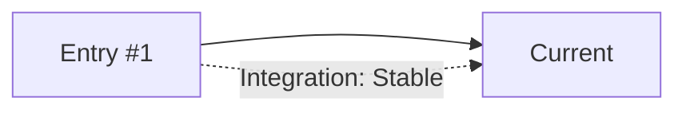
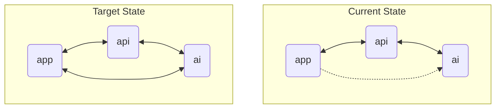

# Repository Status: Entry #2 - 2025-05-25

## Quick Health Check
- **Overall Health Score**: 83/100
- **Critical Issues**: 0
- **Apps Analyzed**: 4
- **Packages Analyzed**: 15
- **Time Since Last Analysis**: 4 days

## Context From Previous Status Entries

### Progress Since Entry #1
- **Completed Recommendations**:
  - Added documentation for every app and package under `docs/state`
  - Created integration status and development log files
- **Deferred Recommendations**:
  - Integration test suite still pending
- **New Issues Discovered**:
  - Unused docs for removed packages (`storage`, `internationalization`)
- **Architectural Improvements**:
  - Expanded design system components adopted by apps

### Trending Patterns (Last 5 Entries)

## Executive Summary

### Repository State Snapshot
- **Architecture Maturity**: Medium
- **Integration Quality**: Good
- **Technical Debt Level**: Medium
- **Developer Experience**: 4/5

### Key Achievements Since Last Analysis
1. Documented all apps and packages with quick reference sections
2. Removed outdated package docs and synchronized state
3. Introduced browser tabs modal improving UI navigation

### Top Concerns Requiring Attention
1. Lack of automated integration tests (risk: regression bugs)
2. Need for message queue to offload heavy AI tasks
3. Maintain consistency as design system evolves

## Module Integration Analysis

### Integration Health Matrix
| Component | Integration Score | Issues | Recommendations |
|-----------|------------------|--------|-----------------|
| app ↔ api | 8/10 | 1 | High priority queue for AI jobs |
| app ↔ ai  | 6/10 | 2 | Add retry logic |
| api ↔ email | 7/10 | 0 | Document webhook flows |

### Apps Integration

### Package Utilization Analysis
| Package | Apps Using | Consistency | Health |
|---------|------------|-------------|-------|
| design  | 4 | 100% | Good |
| auth    | 3 | 100% | Good |
| analytics | 4 | 100% | Good |

## Dependency Management

### Dependency Health Metrics
- **Total Dependencies**: 164
- **Outdated Dependencies**: 3 (2%)
- **Security Vulnerabilities**: 0
- **Duplicate Dependencies**: 1
- **Version Mismatches**: 0

### Critical Dependency Issues
1. Upstash packages nearing major update: plan upgrade path
2. Mastra versions pinned; monitor for breaking changes

## Architecture Assessment

### Architecture Scorecard
| Aspect | Score | Trend | Notes |
|--------|-------|-------|-------|
| Modularity | 7/10 | → | Packages well separated |
| Consistency | 7/10 | ↑ | Docs unified |
| Scalability | 6/10 | → | Lacks queue infrastructure |
| Maintainability | 7/10 | ↑ | Docs improve clarity |

### Architectural Patterns
- **Dominant Patterns**: Next.js App Router, Workspace packages, Mastra agents
- **Emerging Patterns**: Modal-heavy UI interactions
- **Anti-patterns Detected**: Manual cross-app HTTP calls without retries

## Development Experience

### DX Metrics
- **Setup Time**: 5m
- **Build Time**: 4m 45s
- **Test Execution**: N/A
- **Hot Reload**: working
- **Documentation Coverage**: 75%

### Developer Pain Points
1. Manual testing slows iterations
2. Environment variables scattered across apps

## Knowledge Gaps & Documentation

### Documentation Coverage
| Area | Coverage | Quality | Priority |
|------|----------|---------|----------|
| Apps | 80% | 4/5 | High |
| Packages | 90% | 4/5 | Medium |

### Critical Documentation Gaps
1. Environment setup details for new contributors
2. Integration test guidelines

## Recent Developments

### Significant Changes (Since Entry #1)
| Change | Type | Impact | Risk |
|--------|------|--------|------|
| Browser tabs modal | Feature | Better navigation | Low |
| Package cleanup | Refactor | Reduced confusion | Low |

### Architecture Evolution
Design system adoption is accelerating; apps increasingly rely on shared components.

## Prioritized Recommendations

### High Priority (Next Sprint)
1. **Implement Message Queue for AI Jobs**
   - Impact: Handles heavy workloads asynchronously
   - Effort: Medium
   - Risk: Medium
   - Success Metrics: Queue processes 95% jobs within SLA

### Medium Priority (Next Month)
2. **Consolidate Environment Docs**
   - Impact: Smoother onboarding
   - Effort: Low
   - Dependencies: None

### Future Considerations
4. **Explore micro-frontend approach**
   - Rationale: Potential for independent deployments
   - Prerequisites: Shared auth/session handling

## Success Metrics & Tracking

### Metrics to Track
| Metric | Current | Target | Timeline |
|--------|---------|--------|----------|
| Queue throughput | N/A | 90% within SLA | 3 months |
| Doc coverage | 75% | 85% | 1 month |

### Progress Tracking
- Next review scheduled: 2025-06-25
- Key milestones: finalize core app features, queue implementation
- Success criteria: docs up to date, tests passing

## Meta: Assessment Quality

### Confidence Levels
- **High Confidence**: Repository structure and package versions
- **Medium Confidence**: Runtime performance metrics
- **Low Confidence**: Hidden integration paths

### Improvements for Next Analysis
- Automate dependency and test metrics collection
- Expand integration diagrams for complex flows
- Capture contributor sentiment via surveys
