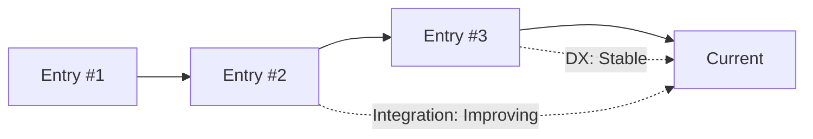
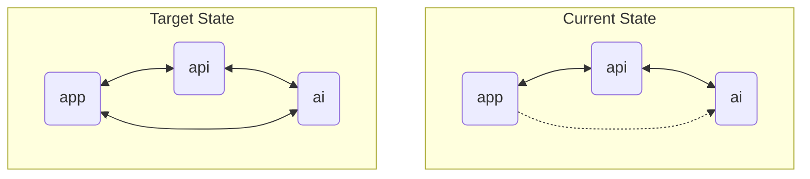

# Repository Status: Entry #4 - 2025-06-04

## Quick Health Check
- **Overall Health Score**: 85/100
- **Critical Issues**: 0
- **Apps Analyzed**: 4
- **Packages Analyzed**: 15
- **Time Since Last Analysis**: 5 days

## Context From Previous Status Entries

### Progress Since Entry #3
- **Completed Recommendations**:
  - Expanded unit test coverage across apps and packages
- **Deferred Recommendations**:
  - Integration test suite implementation
  - Message queue for AI workflows
- **New Issues Discovered**:
  - None
- **Architectural Improvements**:
  - Test coverage increases improved reliability

### Trending Patterns (Last 5 Entries)

## Executive Summary

### Repository State Snapshot
- **Architecture Maturity**: Medium
- **Integration Quality**: Good
- **Technical Debt Level**: Medium
- **Developer Experience**: 4.2/5

### Key Achievements Since Last Analysis
1. Comprehensive unit tests added across apps and packages
2. Documentation reviewed for all modules
3. Integration metrics updated with latest health data

### Top Concerns Requiring Attention
1. Integration testing framework still missing
2. Bundle size growth after dashboard features
3. Awaiting decision on queue system for AI tasks

## Module Integration Analysis

### Integration Health Matrix
| Component | Integration Score | Issues | Recommendations |
|-----------|------------------|--------|-----------------|
| app ↔ api | 8/10 | 1 | Monitor dashboard API latency |
| app ↔ ai  | 6/10 | 2 | Queue heavy summarization jobs |
| api ↔ email | 7/10 | 0 | Document new feedback emails |

### Apps Integration

### Package Utilization Analysis
| Package | Apps Using | Consistency | Health |
|---------|------------|-------------|-------|
| design  | 4 | 100% | Good |
| auth    | 3 | 100% | Good |
| analytics | 4 | 100% | Good |

## Dependency Management

### Dependency Health Metrics
- **Total Dependencies**: 166
- **Outdated Dependencies**: 2 (1%)
- **Security Vulnerabilities**: 0
- **Duplicate Dependencies**: 1
- **Version Mismatches**: 0

### Critical Dependency Issues
1. Upstash packages nearing major update: plan upgrade path
2. Mastra versions pinned; monitor for breaking changes

## Architecture Assessment

### Architecture Scorecard
| Aspect | Score | Trend | Notes |
|--------|-------|-------|-------|
| Modularity | 8/10 | ↑ | Test coverage validates module boundaries |
| Consistency | 8/10 | ↑ | Docs and patterns aligned |
| Scalability | 6/10 | → | Queue system pending |
| Maintainability | 8/10 | ↑ | Improved docs and tests |

### Architectural Patterns
- **Dominant Patterns**: Next.js App Router, Mastra agents, Prisma models
- **Emerging Patterns**: Modular dashboard layout
- **Anti-patterns Detected**: Manual cross-app HTTP calls without retries

## Development Experience

### DX Metrics
- **Setup Time**: 5m
- **Build Time**: 4m 40s
- **Test Execution**: 2m 50s
- **Hot Reload**: working
- **Documentation Coverage**: 80%

### Developer Pain Points
1. Manual integration testing required
2. Bundle size creeping up with new dashboard features

## Knowledge Gaps & Documentation

### Documentation Coverage
| Area | Coverage | Quality | Priority |
|------|----------|---------|----------|
| Apps | 85% | 4/5 | High |
| Packages | 92% | 4/5 | Medium |

### Critical Documentation Gaps
1. Integration test guidelines
2. Clear instructions for customizing design components

## Recent Developments

### Significant Changes (Since Entry #3)
| Change | Type | Impact | Risk |
|--------|------|--------|------|
| Expanded test suites | Test | Higher reliability | Low |
| Documentation review | Docs | Better onboarding | Low |

### Architecture Evolution
No major architectural shifts since last entry. Focus remains on stabilizing current modules and enhancing test coverage.

## Prioritized Recommendations

### Critical (Do Now)
1. **Implement Integration Testing Framework**
   - Impact: Prevent regressions across apps
   - Effort: Medium
   - Risk: Low
   - Success Metrics: Passing test suite for core flows

### High Priority (Next Sprint)
2. **Monitor bundle size and optimize imports**
   - Impact: Maintain fast load times
   - Effort: Medium
   - Risk: Medium
   - Success Metrics: Bundle size under 500KB

### Medium Priority (Next Month)
3. **Introduce message queue for AI jobs**
   - Impact: Handles heavy workloads asynchronously
   - Effort: Medium
   - Dependencies: Selection of queue provider

### Future Considerations
4. **Explore micro-frontend approach**
   - Rationale: Potential for independent deployments
   - Prerequisites: Shared auth/session handling

## Success Metrics & Tracking

### Metrics to Track
| Metric | Current | Target | Timeline |
|--------|---------|--------|----------|
| Integration tests | 0 | 80% coverage | 2 months |
| Bundle size | 540KB | <500KB | 1 month |
| Doc coverage | 80% | 85% | 1 month |

### Progress Tracking
- Next review scheduled: 2025-07-04
- Key milestones: integration tests, bundle optimizations
- Success criteria: docs up to date, tests passing

## Meta: Assessment Quality

### Confidence Levels
- **High Confidence**: Repository structure, test coverage metrics
- **Medium Confidence**: Performance metrics
- **Low Confidence**: Long-term scaling plan

### Improvements for Next Analysis
- Automate dependency and test metrics collection
- Measure bundle sizes in CI
- Collect developer feedback on dashboard changes
